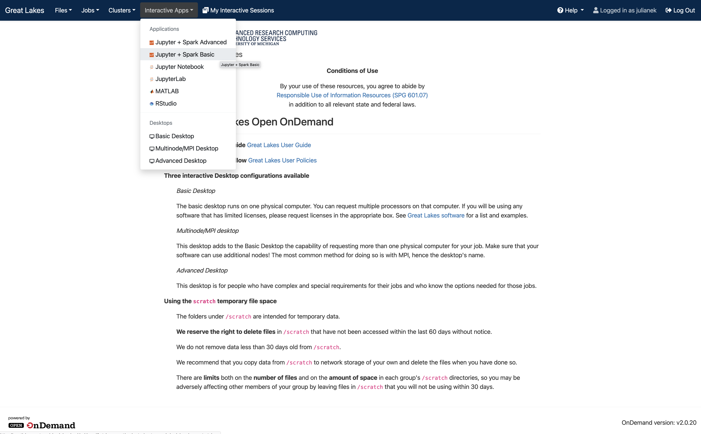
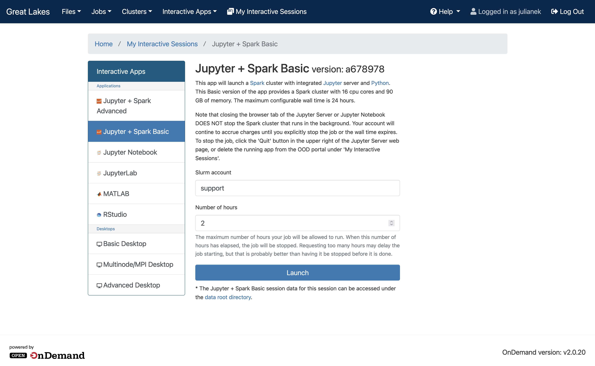
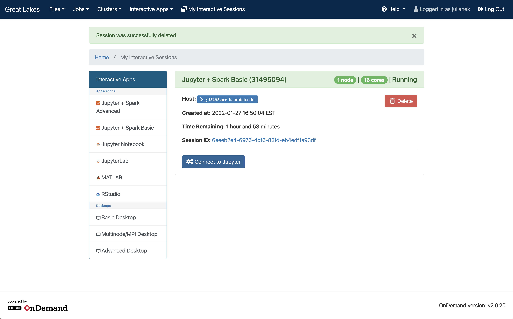
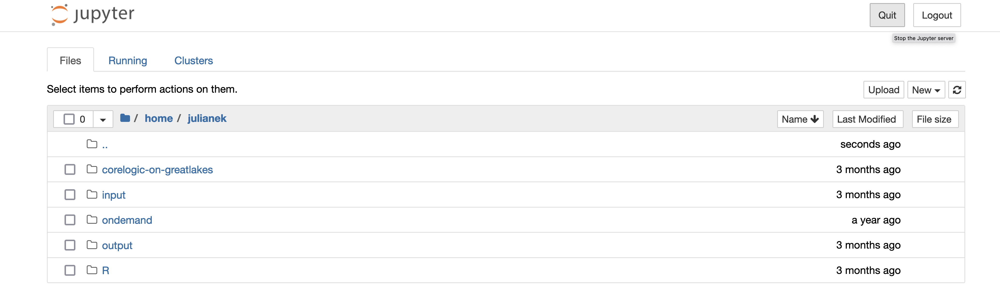

# How to start an Open On Demand (OnDemand/OOD) session on Great Lakes (GL) and load a Jupyter Notebook with Spark enabled

Advanced Research Computing ([ARC](https://arc.umich.edu/))  provides an [online guide](https://arc.umich.edu/open-ondemand/) about the Open OnDemand service for the Great Lakes cluster at the University of Michigan. The online guide describes how you can start different interactive apps on the Great Lakes (GL) cluster, including Jupyter notebooks.

In this guide, we talk specifically about how to start a Jupyter notebook with Spark (PySpark) enabled.

## 1. Use Duo
Two-factor authentication via Duo is required to use Open On Demand (OOD) at the University of Michigan. More information about Duo can be found [here](https://safecomputing.umich.edu/two-factor-authentication).

## 2. Have a user login and access to an account
You will need your own user login (which you can request [here](https://arc.umich.edu/login-request)) and have a Slurm account that will pay for the use of the Great Lakes Cluster. Accounts are available to faculty via the U-M Research Computing package ([UMRCP](https://arc.umich.edu/umrcp/)),  for classes, coursework and workshops (see [here](https://arc.umich.edu/greatlakes/course-accounts/) for more information on course accounts), and for student teams and organizations (more info [here](https://arc.umich.edu/greatlakes/studentteams/)). Users who do not qualify for any of the aforementioned programs can purchase an account based on  [current rates](https://arc.umich.edu/greatlakes/rates/).

## 3. Connect to the U-M campus network
To connect to Great Lakes OnDemand, you either need to be using a computer on campus or connect to the campus network using [VPN](https://its.umich.edu/enterprise/wifi-networks/vpn/getting-started).

## 4. Open a new web browser tab and navigate to the cluster
For web browsers, Firefox, Edge, or Chrome in incognito mode are recommended. Navigate to [https://greatlakes.arc-ts.umich.edu](https://greatlakes.arc-ts.umich.edu), which will prompt you to complete two-factor authentication via Duo.


## 5. Select Jupyter + Spark Basic under Interactive Apps
In the top left menu, go to "```Interactive Apps```" and select "```Jupyter + Spark Basic```" from the drop-down menu.
|  |
|:--:| 
| *Starting a Jupyter + Spark Basic session* |

## 6. Enter required session details (account/hours)
You are  about to launch a Spark cluster with integrated Jupyter server and Python. The Basic version of the app provides a Spark cluster with 16 cpu cores and 90 GB of memory. 

To start the ```Jupyter + Spark Basic``` session, provide the  name of your Slurm account as well as the number of hours (wall time) you are planning to run the app for (here also understood as a "job"). The maximum configurable wall time is 24 hours. Press ```Launch``` when done.

| |
|:--:| 
| *Entering job details for a Jupyter + Spark Basic session* |

Once you launched the new Jupyter + Spark Basic session, it will be listed under ```My Interactive Sessions```. Depending on current cluster capacity, your job may be queued and take a moment to start. Once ready, you will be able to click ```Connect to Jupyter``` to open a jupyter server in a new browser tab.

| |
|:--:|
| *Connecting to the jupyter server* |


##  7. Terminating a job
A job terminates in two ways. Either, the job will be stopped when the requested number of hours has elapsed. Or, you can manually terminate a job in one of two ways: (1) click the ```Quit``` button in the upper right corner of the Jupyter Server web page or (2) delete the running app from the OOD portal under ```My Interactive Sessions```.  Manually quitting the job is necessary if you complete your work before the requested wall time expires. This way,  your account will no longer be charged.


|  | 
|:--:| 
| *Quitting a jupyter session in the Jupyter server* |

|  |
|:--:| 
| *Deleting a jupyter session in `My interactive sessions'* |
